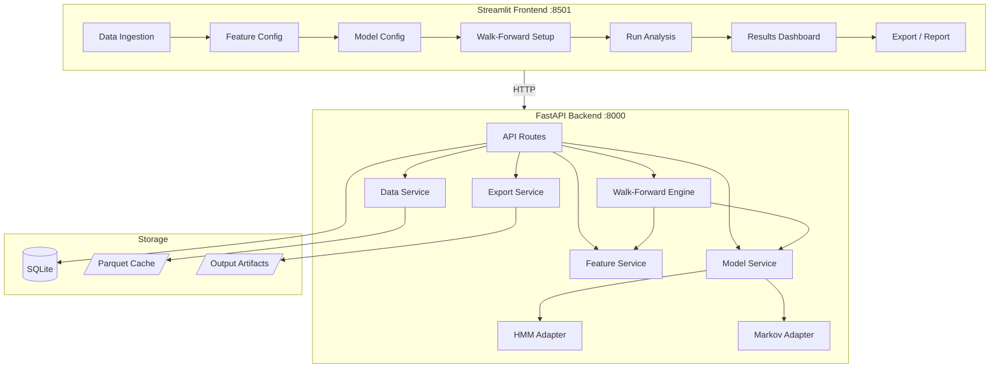

# Regime-Aware Forecasting

A production-structured Python application for **SPY market regime detection** using Gaussian Hidden Markov Models with a **walk-forward validation engine**, exposed through a FastAPI backend and Streamlit frontend.

## Architecture



## Folder Structure

```
regime-aware-forecasting/
├── backend/
│   ├── Dockerfile
│   └── app/
│       ├── main.py                    # FastAPI entrypoint
│       ├── api/
│       │   ├── routes_health.py       # GET /health
│       │   ├── routes_data.py         # POST /data/fetch, GET /data/preview
│       │   ├── routes_analysis.py     # POST /analysis/run, GET .../folds, summary, charts
│       │   ├── routes_runs.py         # GET /runs, DELETE /runs/{id}
│       │   └── routes_export.py       # GET /export/{id}/csv|json|report|states
│       ├── core/
│       │   ├── config.py              # Pydantic settings from .env
│       │   └── logging.py             # Structured logging
│       ├── schemas/
│       │   ├── data.py                # FetchRequest, DataPreview
│       │   ├── analysis.py            # AnalysisRequest, FoldResult, AnalysisResult
│       │   └── runs.py                # RunSummary, RunList
│       ├── services/
│       │   ├── data_service.py        # yfinance fetch, cache, validation
│       │   ├── feature_service.py     # Feature engineering pipeline
│       │   ├── model_service.py       # Model creation, fitting, regime interpretation
│       │   ├── walkforward_service.py # Walk-forward validation engine
│       │   └── export_service.py      # Artifact generation
│       ├── models/
│       │   ├── base.py                # RegimeModelAdapter ABC
│       │   ├── hmm_adapter.py         # hmmlearn GaussianHMM wrapper
│       │   └── statsmodels_adapter.py # MarkovRegression wrapper (optional)
│       ├── db/
│       │   ├── base.py                # SQLAlchemy declarative base
│       │   ├── session.py             # Engine + session factory
│       │   └── models.py              # RunRecord ORM model
│       └── utils/
│           ├── dates.py               # Date parsing/validation
│           ├── metrics.py             # Regime evaluation metrics
│           ├── plotting_payloads.py   # JSON payloads for Plotly charts
│           └── exceptions.py          # Custom exception classes
├── frontend/
│   ├── Dockerfile
│   ├── app.py                         # Home / Overview page
│   ├── components/
│   │   ├── charts.py                  # Plotly chart builders
│   │   ├── cards.py                   # Metric cards, regime tables
│   │   └── sidebar.py                # Backend status, API URL helper
│   └── pages/
│       ├── 1_Data_Ingestion.py
│       ├── 2_Feature_Configuration.py
│       ├── 3_Model_Configuration.py
│       ├── 4_Walk_Forward_Setup.py
│       ├── 5_Run_Analysis.py
│       ├── 6_Results_Dashboard.py
│       ├── 7_Run_History.py
│       └── 8_Export_Report.py
├── tests/
│   ├── conftest.py                    # Shared fixtures
│   ├── test_data_service.py
│   ├── test_feature_service.py
│   ├── test_walkforward.py
│   ├── test_model_adapter.py
│   └── test_api_integration.py
├── data/                              # Cached market data (parquet)
├── outputs/                           # Run artifacts (per run_id)
├── docker-compose.yml
├── requirements.txt
├── pyproject.toml
├── .env.example
└── README.md
```

## Setup Instructions

### Prerequisites

- Python 3.11+
- pip

### 1. Clone and Install

```bash
git clone https://github.com/Hartyplaza/regime-aware-forecasting.git
cd regime-aware-forecasting
python -m venv .venv
source .venv/bin/activate   # Windows: .venv\Scripts\activate
pip install -r requirements.txt
```

### 2. Configure Environment

```bash
cp .env.example .env
# Edit .env if you want to change defaults
```

### 3. Run Backend

```bash
python -m uvicorn backend.app.main:app --reload --port 8000
```

Backend will be at: http://localhost:8000
API docs at: http://localhost:8000/docs

### 4. Run Frontend (in a separate terminal)

```bash
cd frontend
streamlit run app.py --server.port 8501
```

Frontend will be at: http://localhost:8501

### 5. Run Tests

```bash
pytest tests/ -v
```

## Docker Deployment

```bash
docker-compose up --build
```

- Backend: http://localhost:8000
- Frontend: http://localhost:8501

## Environment Variables

| Variable | Default | Description |
|----------|---------|-------------|
| `BACKEND_HOST` | `0.0.0.0` | Backend bind address |
| `BACKEND_PORT` | `8000` | Backend port |
| `DATABASE_URL` | `sqlite:///./data/raf.db` | SQLite database path |
| `DATA_DIR` | `./data` | Directory for cached market data |
| `OUTPUTS_DIR` | `./outputs` | Directory for run artifacts |
| `LOG_LEVEL` | `INFO` | Logging level |
| `CORS_ORIGINS` | `["http://localhost:8501"]` | Allowed CORS origins |
| `BACKEND_URL` | `http://localhost:8000` | Frontend -> Backend URL |
| `RANDOM_SEED` | `42` | Default random seed |

## How to Use the App

1. **Data Ingestion** — Enter ticker (default SPY), date range, and fetch data
2. **Feature Configuration** — Toggle features: volatility windows, momentum, RSI, MACD, etc.
3. **Model Configuration** — Set number of hidden states, covariance type, iterations
4. **Walk-Forward Setup** — Choose expanding/rolling mode, train/test window sizes
5. **Run Analysis** — Execute the pipeline (may take 30-60 seconds)
6. **Results Dashboard** — Explore regime assignments, transition matrices, fold details
7. **Run History** — View and manage past runs
8. **Export & Report** — Download CSV, JSON, and markdown report artifacts

## Modeling Assumptions

- **Primary model:** Gaussian HMM (hmmlearn) — assumes returns/features are drawn from a mixture of Gaussian distributions with Markov switching dynamics
- **Regime interpretation:** States are labeled post-hoc based on observed mean return and volatility (not predefined)
- **Walk-forward validation:** Strictly chronological — no lookahead. Scaler is fit only on each training window
- **Feature engineering:** All rolling calculations use only past data. No future information leaks into features

## Caveats

- **Unsupervised regime detection** has no ground truth — evaluation relies on stability metrics, state separation, and regime persistence
- **Gaussian emission assumption** may not capture fat tails in actual market returns
- **HMM state count** is a hyperparameter — more states can overfit, fewer can underfit
- **Results are sensitive** to feature selection, scaling, and window sizes
- **yfinance data** is free but may have gaps or delayed updates
- **Walk-forward results** show model behavior over history but do not guarantee future performance

## API Reference

| Method | Endpoint | Description |
|--------|----------|-------------|
| `GET` | `/health` | Health check |
| `POST` | `/data/fetch` | Fetch OHLCV data |
| `GET` | `/data/preview` | Preview loaded data |
| `POST` | `/analysis/run` | Run full analysis |
| `GET` | `/analysis/run/{id}` | Get run results |
| `GET` | `/analysis/run/{id}/folds` | Get fold details |
| `GET` | `/analysis/run/{id}/summary` | Get run summary |
| `GET` | `/analysis/run/{id}/charts` | Get chart payloads |
| `GET` | `/runs` | List all runs |
| `DELETE` | `/runs/{id}` | Delete a run |
| `GET` | `/export/{id}/csv` | Download fold metrics CSV |
| `GET` | `/export/{id}/json` | Download summary JSON |
| `GET` | `/export/{id}/report` | Download markdown report |
| `GET` | `/export/{id}/states` | Download state assignments |

## Screenshots

*[Screenshots placeholder — run the app to see the interactive UI]*

## Next Recommended Improvements

- Hyperparameter comparison mode (2 vs 3 vs 4 states side-by-side)
- Regime-conditioned strategy backtest
- PDF report export
- Multi-ticker support
- User-uploaded CSV data source
- Bayesian optimization for state count selection
- Real-time data streaming mode
